# 賞鳥探索冒險遊戲 - 架構圖示

本文件使用 Mermaid 圖表展示專案的各種架構關係。

## 系統架構圖

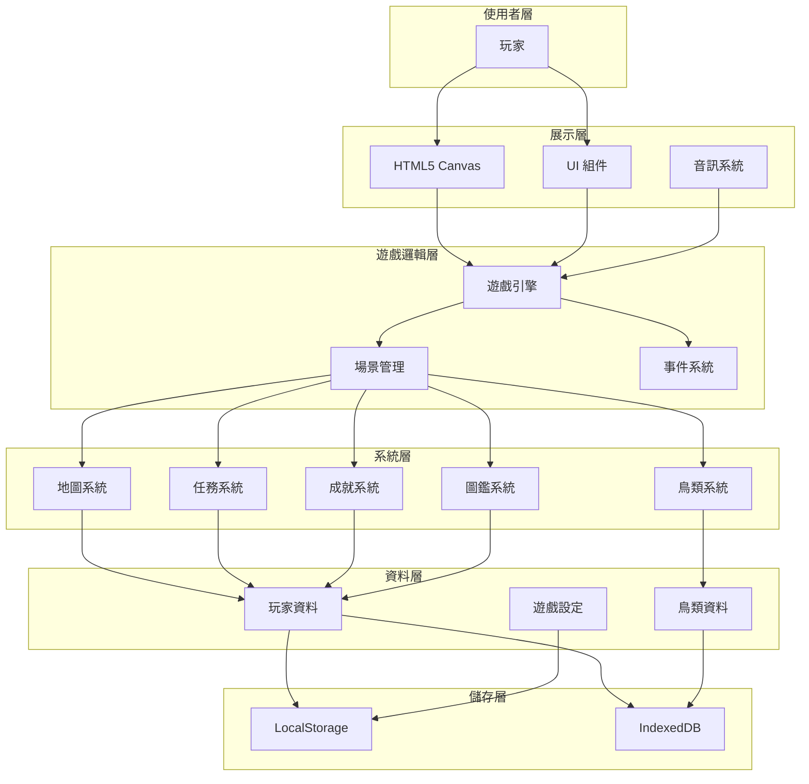

## 遊戲引擎架構

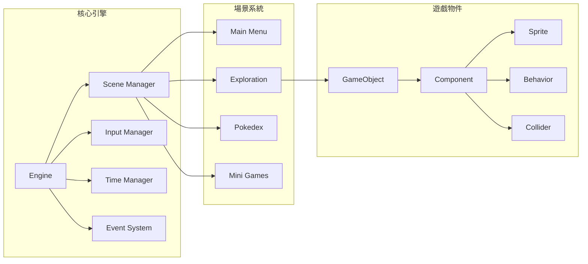

## 資料流程圖

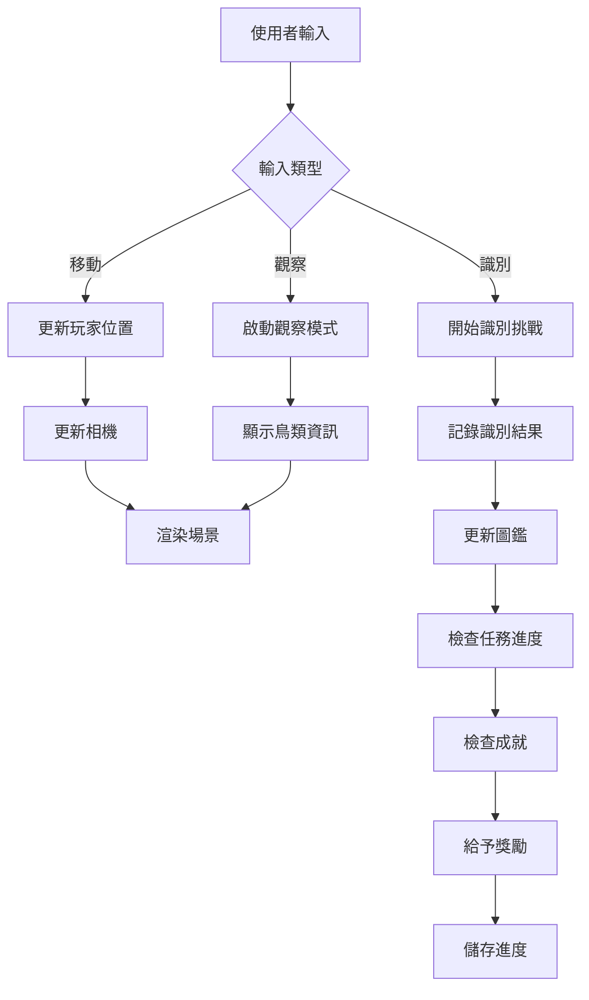

## 鳥類系統流程

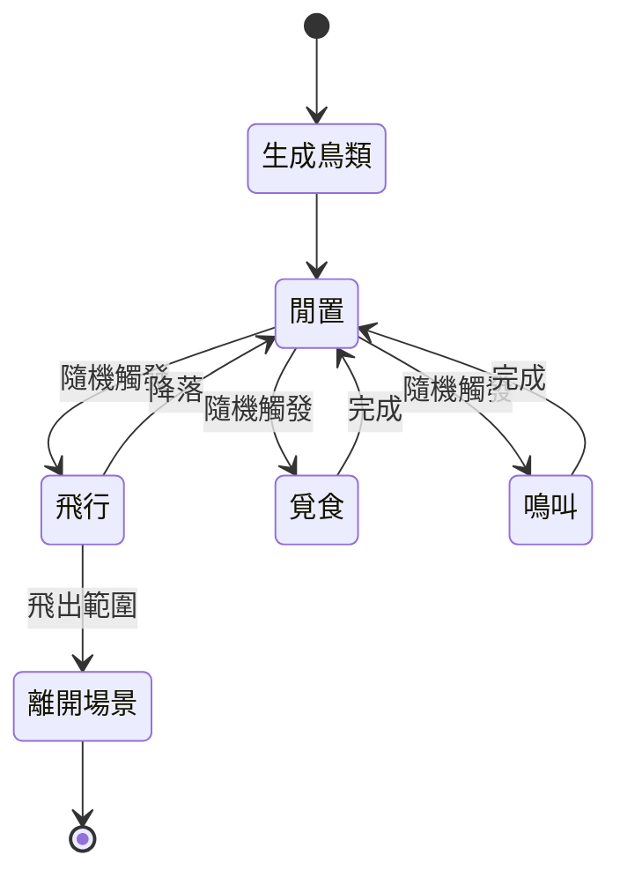

## 識別挑戰流程

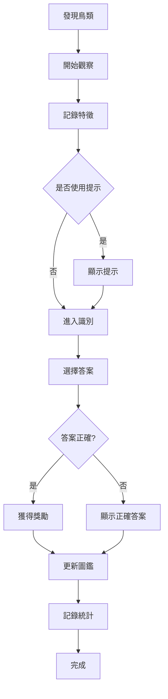

## 任務系統架構

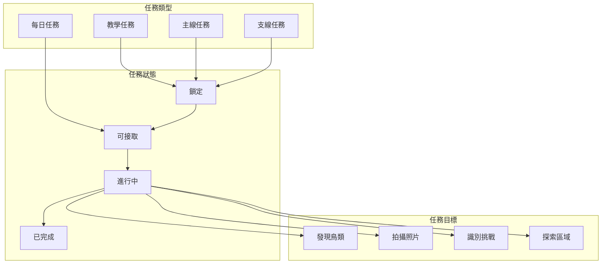

## 成就系統架構

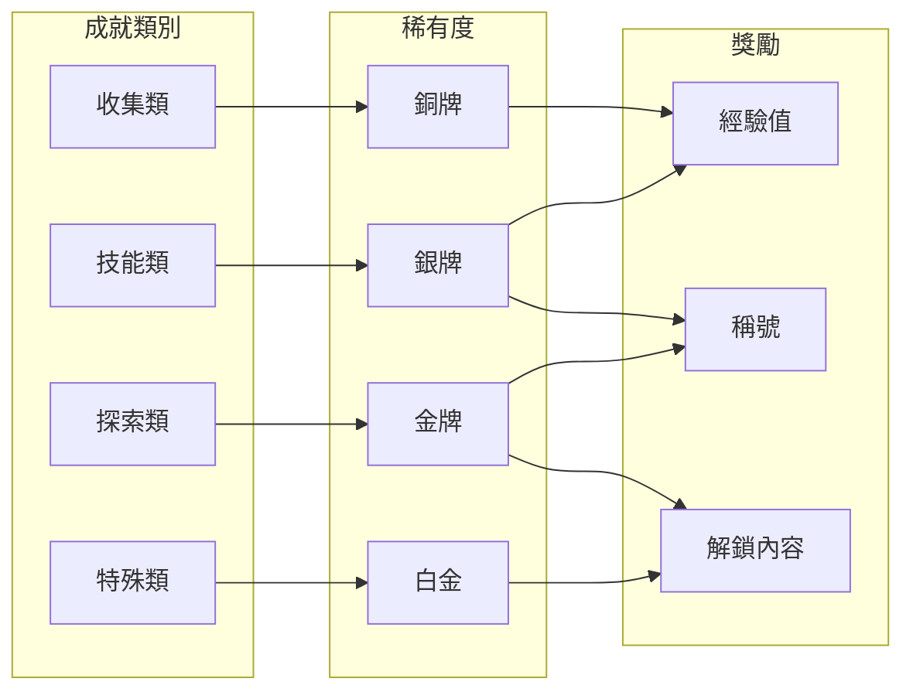

## 認知訓練小遊戲架構

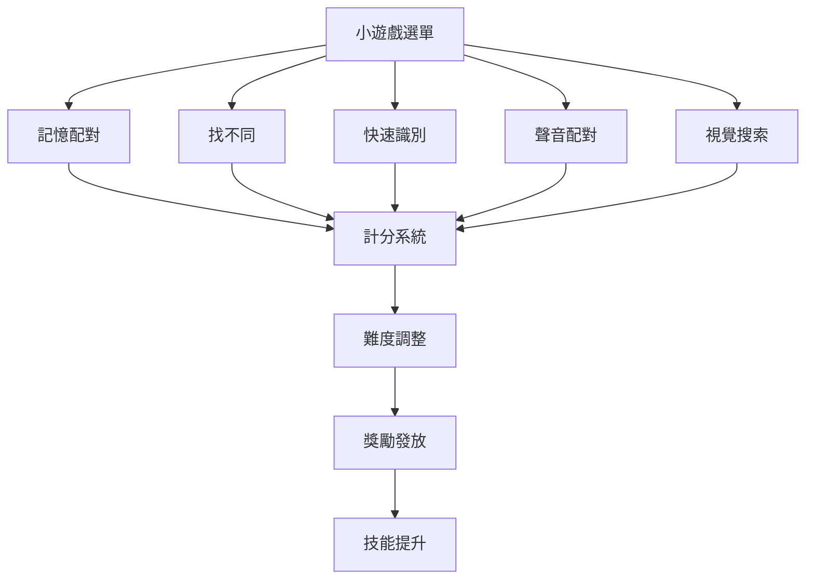

## 儲存系統架構

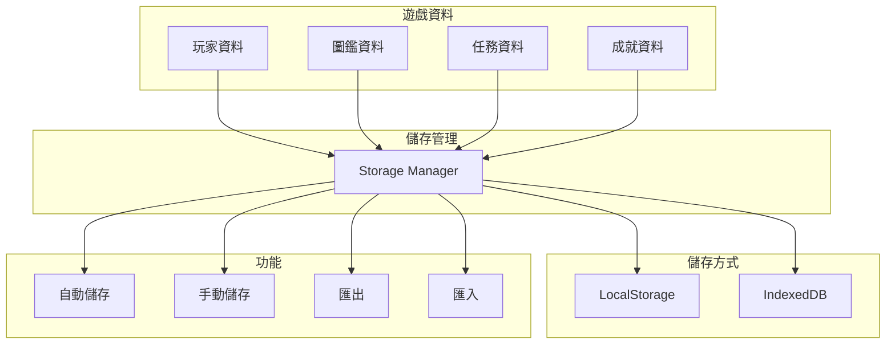

## 開發階段流程

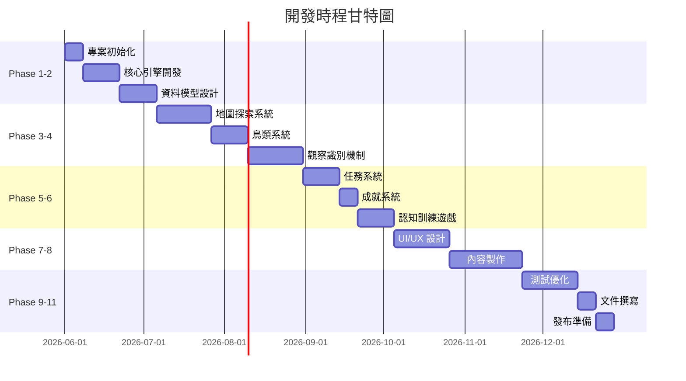

## 玩家進度系統

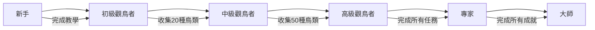

## 技能提升系統

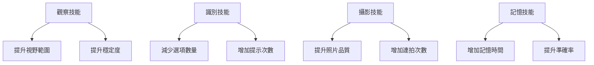

## 事件系統流程

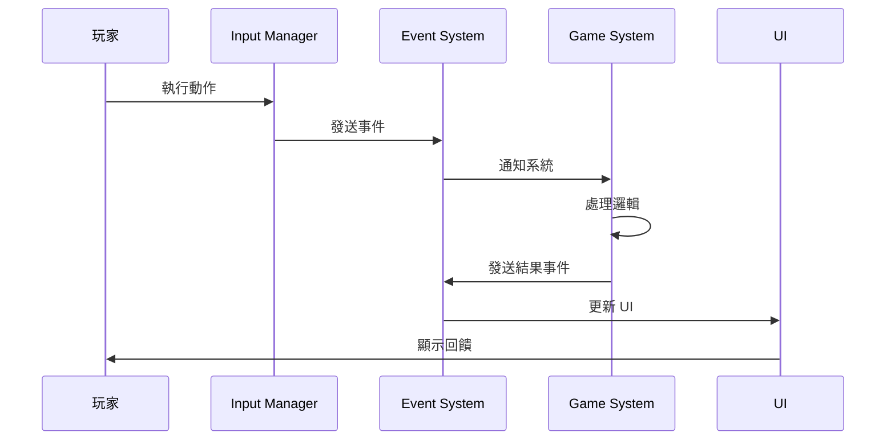

## 資源載入流程

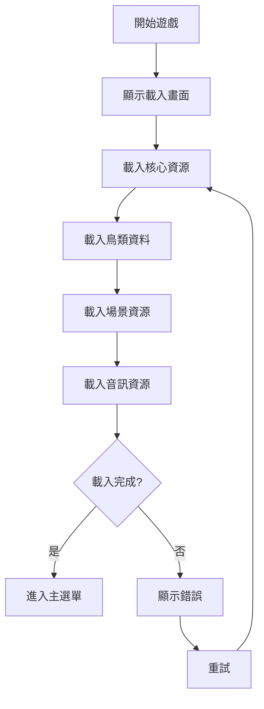

## 效能優化策略

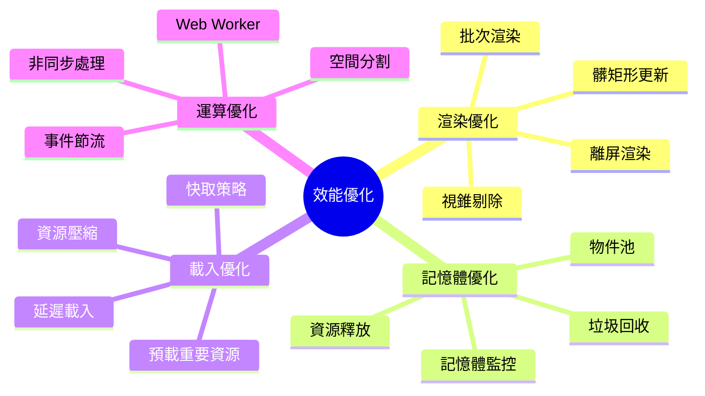

## 測試策略

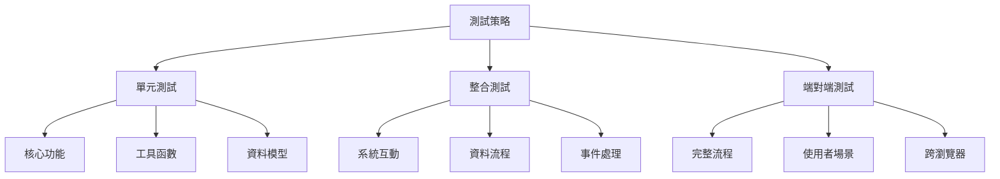

---

這些圖表提供了專案各個層面的視覺化呈現，有助於理解系統架構和開發流程。