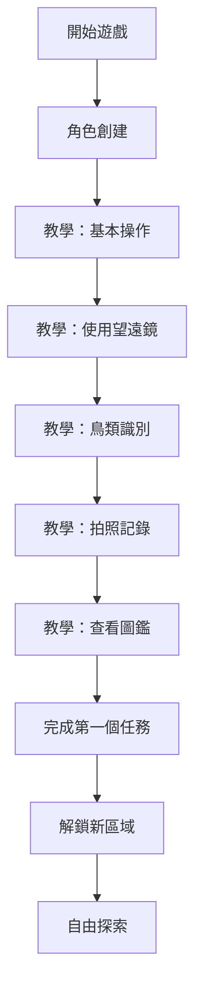
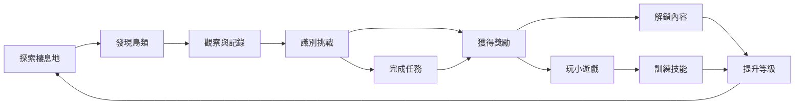

# 賞鳥探索冒險遊戲 - 完整設計文件

## 專案概述

基於神經科學研究《The Tuned Cortex》的發現，開發一款結合認知訓練與娛樂性的賞鳥探索網頁遊戲。遊戲旨在透過虛擬賞鳥體驗，訓練玩家的視覺搜索、模式識別、工作記憶等認知能力。

### 核心設計理念

根據研究發現，賞鳥活動涉及以下認知功能：
- **精細識別**：辨識鳥類的細微特徵
- **視覺搜索**：在複雜環境中尋找目標
- **注意力**：對周圍環境的持續關注
- **運動敏感性**：追蹤移動中的鳥類
- **模式識別**：建立鳥類特徵的心智模型
- **工作記憶**：記住並比對鳥類特徵

## 遊戲架構

### 技術棧

```
前端框架: TypeScript + HTML5 Canvas
遊戲引擎: 自建輕量級 2D 引擎
狀態管理: 自建狀態管理系統
資料儲存: LocalStorage + IndexedDB
建構工具: Vite
程式碼品質: ESLint + Prettier
```

### 專案結構

```
bird-watch-game/
├── src/
│   ├── core/              # 核心遊戲引擎
│   │   ├── Engine.ts      # 主引擎
│   │   ├── Scene.ts       # 場景管理
│   │   ├── GameObject.ts  # 遊戲物件基類
│   │   └── EventSystem.ts # 事件系統
│   ├── systems/           # 遊戲系統
│   │   ├── MapSystem.ts   # 地圖探索系統
│   │   ├── BirdSystem.ts  # 鳥類行為系統
│   │   ├── QuestSystem.ts # 任務系統
│   │   ├── ProgressSystem.ts # 進度追蹤
│   │   └── AchievementSystem.ts # 成就系統
│   ├── models/            # 資料模型
│   │   ├── Bird.ts        # 鳥類資料模型
│   │   ├── Habitat.ts     # 棲息地模型
│   │   ├── Quest.ts       # 任務模型
│   │   ├── Player.ts      # 玩家資料
│   │   └── Pokedex.ts     # 圖鑑模型
│   ├── scenes/            # 遊戲場景
│   │   ├── MainMenuScene.ts
│   │   ├── ExplorationScene.ts
│   │   ├── PokedexScene.ts
│   │   └── MiniGameScene.ts
│   ├── components/        # UI 組件
│   │   ├── HUD.ts         # 抬頭顯示
│   │   ├── BirdCard.ts    # 鳥類卡片
│   │   ├── QuestPanel.ts  # 任務面板
│   │   └── SettingsMenu.ts
│   ├── minigames/         # 認知訓練小遊戲
│   │   ├── MemoryMatch.ts # 記憶配對
│   │   ├── SpotDifference.ts # 找不同
│   │   ├── QuickIdentify.ts # 快速識別
│   │   └── SoundMatch.ts  # 聲音配對
│   ├── data/              # 遊戲資料
│   │   ├── birds/         # 鳥類資料
│   │   ├── habitats/      # 棲息地資料
│   │   └── quests/        # 任務資料
│   ├── assets/            # 遊戲素材
│   │   ├── images/
│   │   ├── sounds/
│   │   └── fonts/
│   └── utils/             # 工具函數
│       ├── Storage.ts
│       ├── Random.ts
│       └── Helpers.ts
├── public/
├── tests/
└── docs/
```

## 核心系統設計

### 1. 地圖探索系統

#### 棲息地類型
- **森林區域**：適合觀察林鳥、啄木鳥等
- **濕地區域**：水鳥、涉禽的棲息地
- **山區**：高山鳥類、猛禽
- **海岸區域**：海鳥、候鳥
- **都市公園**：常見城市鳥類

#### 探索機制
```typescript
interface ExplorationMechanic {
  movement: {
    type: 'point-click' | 'wasd-keys';
    speed: number;
    stamina: boolean; // 是否有體力限制
  };
  visibility: {
    range: number; // 視野範圍
    fogOfWar: boolean; // 戰爭迷霧
  };
  timeSystem: {
    dayNightCycle: boolean;
    weatherEffects: boolean;
    seasonalChanges: boolean;
  };
}
```

#### 地圖設計原則
- 每個棲息地包含 10-15 種鳥類
- 鳥類出現有時間和天氣條件
- 隱藏區域需要完成特定任務解鎖
- 地圖包含互動元素（望遠鏡點、休息站等）

### 2. 鳥類觀察與識別機制

#### 觀察模式

```typescript
interface ObservationMode {
  // 遠距觀察
  binoculars: {
    zoomLevel: number;
    stabilityChallenge: boolean; // 穩定度挑戰
    fieldOfView: number;
  };
  
  // 拍照記錄
  camera: {
    focusSpeed: number;
    shutterTiming: boolean; // 時機挑戰
    photoQuality: 'poor' | 'good' | 'excellent';
  };
  
  // 聲音識別
  audioRecording: {
    noiseLevel: number;
    identificationDifficulty: number;
  };
}
```

#### 識別難度系統

基於研究中的「本地」vs「非本地」概念：

```typescript
interface IdentificationDifficulty {
  familiarity: 'local' | 'regional' | 'rare' | 'exotic';
  visualComplexity: number; // 1-10
  behaviorPattern: 'static' | 'slow' | 'fast' | 'erratic';
  environmentalFactors: {
    lighting: number;
    distance: number;
    obstruction: number;
  };
}
```

#### 識別流程

1. **發現階段**：玩家在地圖上發現鳥類
2. **觀察階段**：使用工具進行觀察
3. **特徵記錄**：記錄關鍵特徵（顏色、大小、行為）
4. **識別挑戰**：
   - 初學者：從 3 個選項中選擇
   - 中級：從 6 個相似物種中選擇
   - 專家：需要輸入物種名稱或從 10+ 選項中選擇
5. **確認與記錄**：成功識別後加入圖鑑

### 3. 圖鑑系統

#### 圖鑑資料結構

```typescript
interface PokedexEntry {
  id: string;
  species: {
    commonName: string;
    scientificName: string;
    family: string;
  };
  
  // 基本資訊
  description: string;
  habitat: string[];
  diet: string;
  size: { length: number; wingspan: number };
  
  // 識別特徵
  identificationFeatures: {
    plumage: string;
    beak: string;
    legs: string;
    distinctiveMarks: string[];
  };
  
  // 行為特徵
  behavior: {
    flightPattern: string;
    feeding: string;
    vocalization: string;
  };
  
  // 觀察記錄
  observations: {
    firstSeen: Date;
    totalSightings: number;
    locations: string[];
    bestPhoto: string;
    notes: string[];
  };
  
  // 遊戲數據
  rarity: 'common' | 'uncommon' | 'rare' | 'legendary';
  points: number;
  unlocked: boolean;
}
```

#### 圖鑑功能

- **搜尋與篩選**：依科別、棲息地、稀有度等
- **比較模式**：並排比較相似物種
- **統計資訊**：收集進度、觀察統計
- **分享功能**：匯出觀察記錄

### 4. 任務系統

#### 任務類型

```typescript
type QuestType = 
  | 'discovery'      // 發現特定鳥類
  | 'photography'    // 拍攝高品質照片
  | 'collection'     // 收集特定數量
  | 'identification' // 識別挑戰
  | 'exploration'    // 探索新區域
  | 'seasonal'       // 季節性任務
  | 'story';         // 劇情任務

interface Quest {
  id: string;
  title: string;
  description: string;
  type: QuestType;
  difficulty: 'beginner' | 'intermediate' | 'expert';
  
  objectives: Objective[];
  rewards: Reward[];
  prerequisites: string[]; // 前置任務
  timeLimit?: number; // 時間限制（分鐘）
  
  status: 'locked' | 'available' | 'active' | 'completed';
  progress: number; // 0-100
}
```

#### 任務範例

**新手任務**：
- 「初次相遇」：在公園發現並識別 5 種常見鳥類
- 「攝影入門」：拍攝 3 張「良好」品質的鳥類照片
- 「聲音世界」：錄製並識別 3 種鳥鳴

**進階任務**：
- 「濕地探險家」：在濕地區域發現 10 種水鳥
- 「黎明觀察」：在日出時段觀察 5 種特定鳥類
- 「稀有獵人」：發現並記錄 1 種稀有鳥類

**專家任務**：
- 「完美圖鑑」：收集特定科別的所有物種
- 「四季觀察」：記錄候鳥的季節性遷徙
- 「大師挑戰」：在限時內識別 20 種隨機鳥類

### 5. 成就系統

#### 成就類別

```typescript
interface Achievement {
  id: string;
  category: 'collection' | 'skill' | 'exploration' | 'social' | 'special';
  title: string;
  description: string;
  icon: string;
  
  requirement: {
    type: string;
    target: number;
    current: number;
  };
  
  reward: {
    points: number;
    title?: string; // 稱號
    unlock?: string; // 解鎖內容
  };
  
  rarity: 'bronze' | 'silver' | 'gold' | 'platinum';
  unlocked: boolean;
  unlockedDate?: Date;
}
```

#### 成就範例

**收集類**：
- 「入門觀鳥者」：圖鑑收集 10 種鳥類
- 「資深鳥友」：圖鑑收集 50 種鳥類
- 「鳥類大師」：圖鑑收集 100 種鳥類
- 「全圖鑑」：收集所有可用鳥類

**技能類**：
- 「鷹眼」：連續 10 次正確識別
- 「攝影大師」：拍攝 50 張優秀照片
- 「聲音專家」：僅透過聲音識別 20 種鳥類

**探索類**：
- 「旅行者」：解鎖所有棲息地
- 「早起的鳥兒」：在日出時段觀察 30 次
- 「夜行者」：在夜間發現 10 種鳥類

**特殊類**：
- 「幸運兒」：發現傳說級稀有鳥類
- 「完美主義者」：所有任務達成 100% 完成度
- 「研究員」：根據研究論文完成特殊挑戰

### 6. 認知訓練小遊戲

基於研究中提到的認知功能設計：

#### 6.1 記憶配對遊戲

**訓練目標**：工作記憶、視覺記憶

```typescript
interface MemoryMatchGame {
  gridSize: 4 | 6 | 8; // 4x4, 6x6, 8x8
  cardTypes: 'species' | 'features' | 'sounds';
  timeLimit: number;
  difficulty: {
    similarSpecies: boolean; // 使用相似物種增加難度
    flipSpeed: number;
  };
}
```

**玩法**：
- 翻開卡片配對相同的鳥類
- 進階版：配對鳥類與其特徵（如鳥鳴、羽毛圖案）
- 專家版：配對相似物種的細微差異

#### 6.2 找不同遊戲

**訓練目標**：精細識別、注意力

```typescript
interface SpotDifferenceGame {
  imageType: 'single-bird' | 'habitat-scene';
  differences: number; // 3-10 個差異
  timeLimit: number;
  hints: number;
}
```

**玩法**：
- 比較兩張相似的鳥類圖片，找出差異
- 差異可能是羽毛顏色、喙型、腿部特徵等
- 訓練玩家注意細節

#### 6.3 快速識別遊戲

**訓練目標**：模式識別、反應速度

```typescript
interface QuickIdentifyGame {
  displayTime: number; // 圖片顯示時間（毫秒）
  options: number; // 選項數量
  difficulty: 'local' | 'regional' | 'mixed';
}
```

**玩法**：
- 快速閃現鳥類圖片
- 玩家需在限時內從選項中選出正確物種
- 呼應研究中的「延遲匹配任務」

#### 6.4 聲音配對遊戲

**訓練目標**：聽覺識別、多感官整合

```typescript
interface SoundMatchGame {
  soundType: 'call' | 'song' | 'alarm';
  visualAid: boolean; // 是否提供視覺提示
  backgroundNoise: number; // 背景噪音等級
}
```

**玩法**：
- 聽鳥鳴聲音，配對正確的鳥類
- 可選擇是否顯示鳥類剪影作為提示
- 訓練聽覺識別能力

#### 6.5 視覺搜索遊戲

**訓練目標**：視覺搜索、空間注意力

```typescript
interface VisualSearchGame {
  sceneComplexity: 'simple' | 'moderate' | 'complex';
  targetBirds: number; // 需要找到的鳥類數量
  distractors: number; // 干擾物數量
  movement: boolean; // 鳥類是否移動
}
```

**玩法**：
- 在複雜的棲息地場景中尋找特定鳥類
- 鳥類可能部分被遮擋或在移動
- 訓練在複雜環境中的搜索能力

### 7. 進度與難度系統

#### 玩家等級系統

```typescript
interface PlayerLevel {
  level: number; // 1-50
  experience: number;
  title: string; // 稱號
  
  skills: {
    observation: number; // 觀察力 1-100
    identification: number; // 識別力 1-100
    photography: number; // 攝影技巧 1-100
    memory: number; // 記憶力 1-100
  };
  
  stats: {
    totalBirdsFound: number;
    totalPhotos: number;
    accuracyRate: number; // 識別準確率
    explorationRate: number; // 探索完成度
  };
}
```

#### 難度調整機制

根據研究發現，專家在面對不熟悉物種時會有不同的神經活動模式：

```typescript
interface DifficultyScaling {
  // 動態難度調整
  adaptive: {
    enabled: boolean;
    basedOn: 'accuracy' | 'speed' | 'both';
    adjustmentRate: number;
  };
  
  // 物種熟悉度
  familiaritySystem: {
    local: string[]; // 玩家常見的物種
    regional: string[]; // 區域性物種
    exotic: string[]; // 外來/稀有物種
  };
  
  // 識別挑戰難度
  identificationChallenge: {
    optionCount: number; // 選項數量
    similarityLevel: number; // 相似度 1-10
    timeLimit: number;
  };
}
```

## UI/UX 設計

### 主要介面

#### 1. 主選單
- 開始探索
- 圖鑑
- 任務
- 成就
- 小遊戲
- 設定

#### 2. 探索介面（HUD）

```
┌─────────────────────────────────────────┐
│ [地圖] [圖鑑] [任務]    ⭐ 123  💎 45   │ 頂部工具列
├─────────────────────────────────────────┤
│                                         │
│                                         │
│           [遊戲主畫面]                   │
│                                         │
│                                         │
├─────────────────────────────────────────┤
│ 🔭 望遠鏡  📷 相機  🎤 錄音  📝 筆記    │ 工具列
└─────────────────────────────────────────┘
```

#### 3. 鳥類識別介面

```
┌─────────────────────────────────────────┐
│           [鳥類圖片/剪影]                │
│                                         │
│  觀察到的特徵：                          │
│  ☑ 中型鳥類                             │
│  ☑ 紅色胸部                             │
│  ☑ 黑色頭部                             │
│  ☐ 長尾巴                               │
│                                         │
│  這是什麼鳥？                            │
│  ○ 紅胸鶲                               │
│  ○ 黃腹琉璃                             │
│  ○ 紅尾鶲                               │
│                                         │
│     [提示] [跳過] [確認]                │
└─────────────────────────────────────────┘
```

#### 4. 圖鑑介面

```
┌──────────┬──────────────────────────────┐
│          │  紅胸鶲 Ficedula parva        │
│  [圖片]  │  科別：鶲科                    │
│          │  稀有度：★★☆☆☆              │
│          │                              │
│          │  特徵：                       │
│          │  • 雄鳥胸部橙紅色             │
├──────────┤  • 體長約 13cm               │
│ 觀察記錄  │  • 常見於森林中下層           │
│          │                              │
│ 首次發現  │  觀察統計：                   │
│ 2026/5/1 │  • 觀察次數：12              │
│          │  • 最佳照片：★★★★☆          │
│ 觀察地點  │  • 筆記：3 則                │
│ • 陽明山  │                              │
│ • 烏來   │  [查看照片] [編輯筆記]        │
└──────────┴──────────────────────────────┘
```

### 視覺風格

- **色調**：自然、清新的配色（綠色、藍色、棕色為主）
- **字體**：清晰易讀的無襯線字體
- **圖示**：簡潔的扁平化設計
- **動畫**：流暢但不過度的過場效果
- **響應式**：支援桌面和平板裝置

## 資料設計

### 台灣鳥類資料結構

#### 優先收錄物種（第一階段）

**常見留鳥（20 種）**：
- 麻雀、綠繡眼、白頭翁、紅嘴黑鵯
- 五色鳥、小啄木、樹鵲、喜鵲
- 珠頸斑鳩、金背鳩、翠鳥、小白鷺
- 夜鷺、黃頭鷺、大卷尾、褐頭鷦鶯
- 粉紅鸚嘴、山紅頭、白腰文鳥、斑文鳥

**常見候鳥（10 種）**：
- 家燕、赤腰燕、灰面鵟鷹、紅尾伯勞
- 黃鶺鴒、白鶺鴒、小水鴨、花嘴鴨
- 磯鷸、青足鷸

**特有種（10 種）**：
- 台灣藍鵲、台灣紫嘯鶇、台灣畫眉
- 冠羽畫眉、白耳畫眉、黃山雀
- 青背山雀、棕面鶯、火冠戴菊鳥
- 台灣竹雞

#### 資料來源標註

```typescript
interface BirdDataSource {
  images: {
    source: 'eBird' | 'Wikipedia' | 'iNaturalist' | 'Flickr';
    license: string; // CC BY-SA 4.0 等
    author: string;
    url: string;
  }[];
  
  information: {
    source: 'eBird Taiwan' | '台灣野鳥圖鑑' | '特有生物研究保育中心';
    lastUpdated: Date;
  };
  
  sounds: {
    source: 'xeno-canto' | 'Macaulay Library';
    recordist: string;
    license: string;
  }[];
}
```

### 棲息地資料

#### 台灣代表性棲息地

1. **都市公園**（新手區域）
   - 大安森林公園、植物園
   - 常見物種：麻雀、綠繡眼、白頭翁

2. **低海拔森林**
   - 烏來、滿月圓
   - 常見物種：五色鳥、小啄木、台灣藍鵲

3. **中海拔森林**
   - 溪頭、阿里山
   - 常見物種：冠羽畫眉、白耳畫眉、青背山雀

4. **高海拔森林**
   - 合歡山、雪山
   - 常見物種：火冠戴菊鳥、岩鷚、酒紅朱雀

5. **濕地**
   - 關渡、鰲鼓
   - 常見物種：小白鷺、夜鷺、小水鴨

6. **海岸**
   - 野柳、墾丁
   - 常見物種：岩鷺、磯鷸、燕鷗

## 遊戲流程設計

### 新手引導流程



### 核心遊戲循環



### 長期進程設計

**第一階段（1-10 級）**：
- 學習基本操作
- 收集常見鳥類
- 完成新手任務
- 解鎖都市公園和低海拔森林

**第二階段（11-25 級）**：
- 挑戰中等難度識別
- 收集候鳥和特有種
- 解鎖中海拔森林和濕地
- 參與認知訓練小遊戲

**第三階段（26-40 級）**：
- 專家級識別挑戰
- 收集稀有和傳說鳥類
- 解鎖高海拔和海岸區域
- 完成高難度任務鏈

**第四階段（41-50 級）**：
- 完成圖鑑
- 挑戰所有成就
- 大師級認知訓練
- 解鎖特殊內容

## 技術實作重點

### 1. 效能優化

```typescript
// 物件池模式
class ObjectPool<T> {
  private pool: T[] = [];
  private factory: () => T;
  
  constructor(factory: () => T, initialSize: number) {
    this.factory = factory;
    for (let i = 0; i < initialSize; i++) {
      this.pool.push(factory());
    }
  }
  
  acquire(): T {
    return this.pool.pop() || this.factory();
  }
  
  release(obj: T): void {
    this.pool.push(obj);
  }
}

// 使用範例：鳥類物件池
const birdPool = new ObjectPool(() => new Bird(), 50);
```

### 2. 資料持久化

```typescript
interface SaveData {
  version: string;
  player: PlayerData;
  pokedex: PokedexData;
  quests: QuestData[];
  achievements: AchievementData[];
  settings: GameSettings;
  timestamp: number;
}

class SaveManager {
  private static SAVE_KEY = 'bird-watch-save';
  
  static async save(data: SaveData): Promise<void> {
    // 使用 IndexedDB 儲存大量資料
    // 使用 LocalStorage 儲存設定
  }
  
  static async load(): Promise<SaveData | null> {
    // 載入並驗證存檔
  }
  
  static async export(): Promise<string> {
    // 匯出為 JSON
  }
  
  static async import(json: string): Promise<void> {
    // 匯入存檔
  }
}
```

### 3. 事件系統

```typescript
class EventBus {
  private listeners: Map<string, Function[]> = new Map();
  
  on(event: string, callback: Function): void {
    if (!this.listeners.has(event)) {
      this.listeners.set(event, []);
    }
    this.listeners.get(event)!.push(callback);
  }
  
  emit(event: string, data?: any): void {
    const callbacks = this.listeners.get(event);
    if (callbacks) {
      callbacks.forEach(cb => cb(data));
    }
  }
  
  off(event: string, callback: Function): void {
    const callbacks = this.listeners.get(event);
    if (callbacks) {
      const index = callbacks.indexOf(callback);
      if (index > -1) {
        callbacks.splice(index, 1);
      }
    }
  }
}

// 使用範例
eventBus.on('bird:discovered', (bird: Bird) => {
  console.log(`發現新鳥類：${bird.name}`);
  achievementSystem.checkProgress('discovery', bird);
});
```

### 4. 狀態管理

```typescript
interface GameState {
  scene: string;
  player: PlayerState;
  world: WorldState;
  ui: UIState;
}

class StateManager {
  private state: GameState;
  private history: GameState[] = [];
  
  getState(): Readonly<GameState> {
    return this.state;
  }
  
  setState(newState: Partial<GameState>): void {
    this.history.push({ ...this.state });
    this.state = { ...this.state, ...newState };
    eventBus.emit('state:changed', this.state);
  }
  
  undo(): void {
    if (this.history.length > 0) {
      this.state = this.history.pop()!;
      eventBus.emit('state:changed', this.state);
    }
  }
}
```

## 開發階段規劃

### Phase 1: 核心架構（2-3 週）
- [x] 專案初始化
- [ ] 遊戲引擎核心
- [ ] 場景管理系統
- [ ] 基本 UI 框架
- [ ] 資料模型定義

### Phase 2: 基礎功能（3-4 週）
- [ ] 地圖探索系統
- [ ] 鳥類生成與行為
- [ ] 觀察與識別機制
- [ ] 圖鑑系統
- [ ] 存檔系統

### Phase 3: 遊戲系統（3-4 週）
- [ ] 任務系統
- [ ] 成就系統
- [ ] 進度追蹤
- [ ] 難度調整
- [ ] 獎勵機制

### Phase 4: 認知訓練（2-3 週）
- [ ] 記憶配對遊戲
- [ ] 找不同遊戲
- [ ] 快速識別遊戲
- [ ] 聲音配對遊戲
- [ ] 視覺搜索遊戲

### Phase 5: 內容製作（4-5 週）
- [ ] 台灣鳥類資料整理
- [ ] 圖片素材收集與處理
- [ ] 聲音素材收集
- [ ] 棲息地場景設計
- [ ] 任務內容撰寫

### Phase 6: 優化與測試（2-3 週）
- [ ] 效能優化
- [ ] Bug 修復
- [ ] 平衡性調整
- [ ] 使用者測試
- [ ] 文件撰寫

### Phase 7: 發布準備（1-2 週）
- [ ] 最終測試
- [ ] 部署設定
- [ ] 使用手冊
- [ ] 宣傳素材
- [ ] 正式發布

## 擴充性考量

### 未來可能的擴充方向

1. **多人功能**
   - 觀察記錄分享
   - 排行榜系統
   - 協作任務

2. **AR 整合**
   - 使用手機相機進行實境賞鳥
   - GPS 定位真實棲息地

3. **教育模式**
   - 學校教學版本
   - 詳細的生態知識
   - 保育教育內容

4. **社群功能**
   - 玩家社群
   - 觀察記錄交流
   - 專家指導系統

5. **更多地區**
   - 其他國家的鳥類
   - 全球候鳥遷徙
   - 特殊生態系統

## 參考資源

### 學術研究
- Wing, E. A., et al. (2026). The Tuned Cortex: Convergent Expertise-Related Structural and Functional Remodeling across the Adult Lifespan. JNeurosci.

### 鳥類資料來源
- eBird Taiwan: https://ebird.org/taiwan
- 台灣野鳥圖鑑
- 特有生物研究保育中心
- xeno-canto (鳥鳴資料庫)

### 技術參考
- TypeScript 官方文件
- HTML5 Canvas API
- Web Audio API
- IndexedDB API

### 遊戲設計參考
- Pokémon GO (探索機制)
- Alba: A Wildlife Adventure (賞鳥遊戲)
- iNaturalist (物種識別)

---

## 總結

這個賞鳥探索冒險遊戲結合了神經科學研究的發現，設計了一個既有趣又具教育意義的遊戲體驗。透過探索、觀察、識別和記錄鳥類，玩家不僅能學習鳥類知識，還能訓練多種認知功能。

遊戲的核心設計理念是：
1. **真實性**：基於真實的台灣鳥類和棲息地
2. **教育性**：融入生態保育和科學知識
3. **挑戰性**：提供適合不同程度玩家的難度
4. **趣味性**：豐富的遊戲機制和獎勵系統
5. **科學性**：根據神經科學研究設計認知訓練

期待這個遊戲能讓更多人認識台灣的鳥類，並享受賞鳥的樂趣！